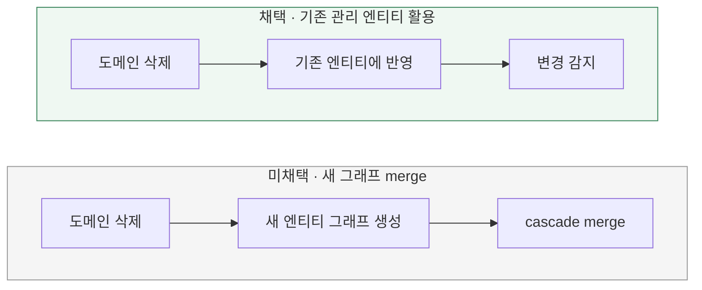

# 도메인 변경을 어느 JPA 객체에 반영할까?

[← 전체 선택 현황](total_trade_off.md)

## 판단할 문제

브랜드·상품을 같은 트랜잭션에서 조회한 뒤 순수 도메인에서 삭제 상태를 변경한다.
기존 관리 엔티티에 결과를 반영할지, 새 엔티티 그래프를 재구성해 merge할지 비교한다.

> **채택 — 기존 관리 엔티티에 반영**
>
> 이미 조회한 엔티티를 활용하고 삭제 상태의 반영 범위를 명확히 한다.
> 상품 ID 대응과 매핑 코드의 유지보수 비용은 감수한다.

## 흐름 비교

아래는 설계안이다. 아직 구현하지 않았다.

## 장단점 비교

| 기준 | 기존 관리 엔티티에 반영 | 새 엔티티 그래프 merge |
|---|---|---|
| 객체 활용 | 조회한 관리 객체 재사용 | 추가 엔티티 그래프 생성 |
| 반영 범위 | 삭제 상태만 명시적으로 반영하기 쉬움 | 전달한 그래프 상태의 완전성 관리 필요 |
| 매핑 비용 | 상품 ID 대응·변경 필드 매핑 | ID·필드·메타데이터·관계 재구성 |
| 이점 | 보존할 가격·재고 등을 건드리지 않기 쉬움 | 앞서 조회한 객체를 직접 활용하는 코드 감소 가능 |
| 위험 | 잘못된 ID 대응·누락·과도한 필드 복사 | 불완전하거나 오래된 그래프 상태 반영 |

## 옵션별 판단

> **채택 — 기존 객체 반영:** 같은 트랜잭션에서 이미 확보한 객체에 도메인이 결정한 결과를 적용한다.

> **미채택 — 그래프 재구성:** 가능한 방식이지만 이번 흐름에서는 새 그래프를 구성할 필요가 적다.

Mapper는 정책을 재판단하지 않는다. `restore()`는 메모리의 도메인 복원이며 재조회가 아니다.
Repository가 같은 영속성 컨텍스트의 엔티티를 ID로 다시 요청해도 매번 SELECT가 필요한 것은 아니다.
실제 SQL 실행 횟수는 후속 검증에서 확인한다.

`FetchType`은 조회 시점, `CascadeType`은 persist·merge·remove 등의 전파와 관련된다.
관리 중인 자식의 변경 감지는 cascade 없이도 적용되며, cascade가 순수 도메인의 값을 엔티티에 복사하지는 않는다.
이 비교는 `save()` 호출 유무보다 **반영할 객체와 상태의 구성 방식**에 관한 것이다.

## 구현 시 확인

상품 ID가 올바르게 대응되는지, 변경이 누락되지 않는지, 삭제 상태 외의 값이 보존되는지 구현·테스트에서 확인한다.
이미 선택한 매핑 방식의 검증 항목이며 별도 트레이드오프를 요구하지 않는다.
관련 JPA 동작은 [Hibernate 문서](https://docs.hibernate.org/orm/6.6/introduction/html_single/)와
[Spring Data JPA 저장 설명](https://docs.spring.io/spring-data/jpa/reference/3.5/jpa/entity-persistence.html)을 참고한다.
