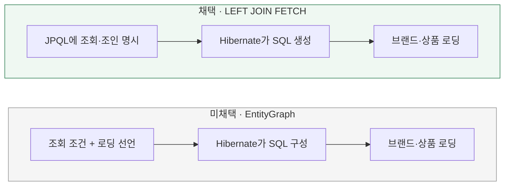

# 삭제용 조회를 어떻게 명시할까?

[← 전체 선택 현황](total_trade_off.md)

## 판단할 문제

[삭제 전용 조회](03-loading.md)에서 브랜드와 상품을 함께 가져와야 한다.
조회 조건과 로딩 방식을 JPQL에 명시할지, 연관관계 로딩을 EntityGraph로 선언할지 비교한다.

> **채택 — JPQL의 LEFT JOIN FETCH**
>
> 브랜드·상품을 함께 읽고 상품이 없는 브랜드도 포함한다는 의도를 쿼리에 직접 표현한다.
> JPQL 관리 비용은 감수하며, 생성된 SQL과 추가 조회 여부는 별도로 검증한다.

## 흐름 비교

아래는 확정한 설계 방향이다. 실제 코드는 아직 구현하지 않았다.



## 장단점 비교

| 기준 | LEFT JOIN FETCH | EntityGraph |
|---|---|---|
| 의도 표현 | 조건·조인 종류·로딩 관계를 JPQL에 명시 | 조회 조건과 로딩할 관계를 분리해 선언 |
| 유지보수 | 직접 작성한 JPQL 관리 필요 | 로딩 관계를 어노테이션으로 간결하게 관리 |
| SQL 예측 | 함께 읽을 관계와 조인이 코드에 드러남 | 구체적인 SQL 구성은 구현체에 맡김 |
| 검증 비용 | 실제 SQL·추가 조회 확인 필요 | 실제 SQL·추가 조회 확인 필요 |

## 옵션별 판단

> **채택 — LEFT JOIN FETCH:** 브랜드 하나와 상품 컬렉션 하나를 읽는 고정된 조회에서 의도를 명시적으로 통제한다.

> **미채택 — EntityGraph:** 충분히 가능한 대안이지만 이번에는 로딩할 관계와 조인 종류를 쿼리에서 함께 읽는 방식을 선호한다.

## 조회·검증 계약

- 네이티브 SQL이 아니라 엔티티·연관관계 이름을 사용하는 JPQL이다. 설명용 쿼리는 아래와 같다.

```sql
select b
from BrandJpaEntity b
left join fetch b.products
where b.id = :brandId
```

- 상품 없는 브랜드도 조회한다. 재고·상품 삭제 여부로 컬렉션을 필터링하지 않고 전체를 읽은 뒤 도메인에서 미삭제 상품만 변경한다.
- JPQL도 SQL로 변환된다. EntityGraph만 검증이 필요한 블랙박스로 취급하거나 성능이 열등하다고 단정하지 않는다.
- 실제 SQL·추가 조회와 상품 누락 여부를 후속 구현에서 확인한다. 메서드 이름은 구현 계획에서 구체화한다.

[Hibernate 조회 가이드](https://docs.hibernate.org/orm/6.6/querylanguage/html_single/) ·
[Spring Data JPA 조회 설명](https://docs.spring.io/spring-data/jpa/reference/jpa/query-methods.html)
