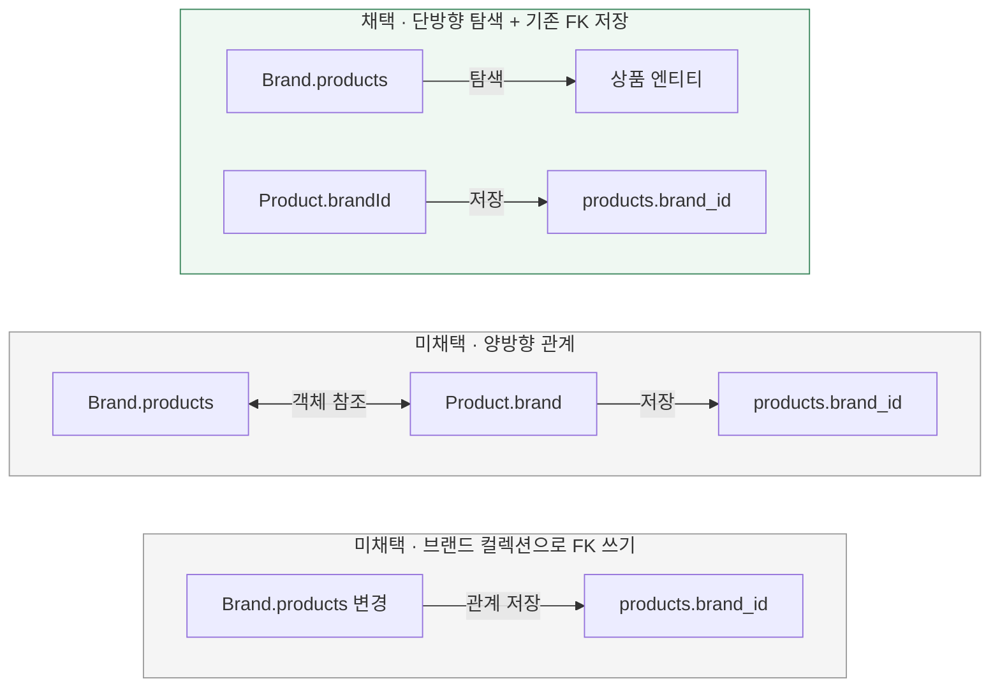

# 브랜드와 상품의 JPA 관계를 어떻게 연결할까?

[← 전체 선택 현황](total_trade_off.md)

## 판단할 문제

삭제에는 브랜드에서 상품으로의 탐색이 필요하고, 상품에서 브랜드 객체를 탐색할 필요는 없다.
기존 상품 생성·조회가 `brandId`를 사용하고 상품의 브랜드 변경도 허용하지 않는 상황에서 매핑 방향과 FK 쓰기 책임을 비교한다.

> **채택 — 브랜드의 조회용 단방향 OneToMany**
>
> 기존 `ProductJpaEntity.brandId`가 FK 저장을 담당하고, 브랜드 컬렉션은 소속 상품 탐색에 사용한다.
> 불필요한 역방향 참조를 추가하지 않는 대신 컬렉션 추가만으로 FK가 저장되지 않는 제한을 받아들인다.

## 흐름 비교

아래는 설계안이다. 어그리게이트의 삭제 책임과 JPA의 FK 쓰기 책임은 구분한다.



## 장단점 비교

| 기준 | 조회용 단방향 컬렉션 | 양방향 ManyToOne 추가 | 브랜드 컬렉션의 FK 쓰기 |
|---|---|---|---|
| 탐색 | 브랜드 → 상품만 제공 | 양쪽 객체 탐색 가능 | 브랜드 → 상품만 제공 |
| FK 저장 | 기존 상품 brandId 활용 | 상품의 브랜드 객체 참조가 담당 | 브랜드 컬렉션이 담당 |
| 기존 코드 | 상품 생성·ID 기반 조회 유지 | Mapper·생성·조회 코드 조정 필요 | 상품 생성·관계 저장 흐름 조정 필요 |
| 관리 비용 | 컬렉션 변경과 FK 저장을 구분 | 양쪽 객체 관계 일치 관리 | 컬렉션 변경이 FK에 주는 영향 관리 |

## 옵션별 판단

> **채택 — 조회용 단방향:** 필요한 탐색만 추가하고 기존 FK 저장 경로를 유지한다. 브랜드는 도메인에서 상품의 삭제 생명주기를 계속 책임진다.

> **미채택 — 양방향:** 표준적인 선택이지만 이번 요구사항에는 상품에서 브랜드 객체를 탐색할 필요가 없다. 루트가 브랜드라는 이유만으로 배제하는 것은 아니다.

> **미채택 — 브랜드에서 FK 쓰기:** 컬렉션으로 소속 관계를 저장할 필요가 없어 기존 상품 생성 흐름까지 조정하지 않는다.

## 매핑·검증 계약

- `BrandJpaEntity.products`는 `@OneToMany(fetch = FetchType.LAZY)`로 두고 다음 FK 매핑을 사용한다.

```java
@JoinColumn(
    name = "brand_id",
    insertable = false,
    updatable = false
)
```

- `ProductJpaEntity.brandId`와 기존 `brand_id` 컬럼 매핑을 유지한다. 상품에 `ManyToOne`을 추가하거나 브랜드에 `mappedBy`를 지정하지 않는다.
- 위 쓰기 제한은 브랜드의 연관관계 매핑을 통한 **FK 쓰기**에 대한 것이다. 관리 중인 상품의 `deleted` 변경은 [변경 감지 방식](05-state-mapping.md)으로 반영한다.
- `brand.products.add(product)`만으로 관계가 저장되지는 않는다. 상품 생성은 기존처럼 `brandId`를 지정해 저장한다.
- 조회는 [LEFT JOIN FETCH](07-fetch-strategy.md)를 사용한다. 기존 상품 생성·조회와 논리 삭제 시 FK 보존을 검증한다.

[JPA JoinColumn 설명](https://jakarta.ee/specifications/persistence/3.1/apidocs/jakarta.persistence/jakarta/persistence/joincolumn)
