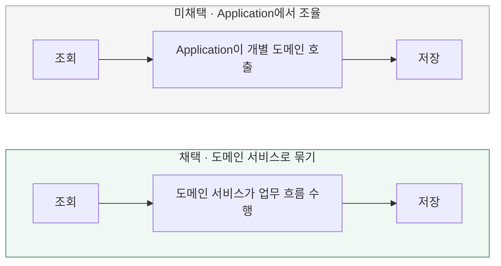

# 주문 확정의 업무 규칙을 어디에 명시할까?

[← 전체 선택 현황](total_trade_off.md)

현재 상태: 채택안을 구현하고 최종 모듈 검사를 통과했다. 설계 당시 비교와 구분되는 실제 검증 범위·남은 한계는 [구현 결과](../result.md)를 따른다.

## 판단할 문제

현재 Application의 `ConfirmOrderService`가 주문·상품·포인트의 도메인 동작을 조율하고 사용·결제 기록을 만든다.
각 객체의 규칙뿐 아니라 이 변경들이 함께 일어나야 한다는 전체 업무 계약을 어디에 표현할지 비교한다.
판단 기준은 업무 흐름의 명시성, 다른 레이어에 대한 의존 여부, 테스트와 구조 유지 비용이다.

> **채택 — B. 순수 도메인 서비스로 업무 흐름 묶기**
>
> 주문 확정의 정책과 불변식을 도메인에 명시하고 다른 레이어에 의존하지 않게 한다.
> 개별 객체의 규칙은 유지하며, 업무 흐름을 표현할 도메인 서비스와 필요한 결과 타입의 추가 비용을 감수한다.

## 흐름 비교

아래는 합의한 방향이며 구현 완료를 의미하지 않는다. 두 옵션 모두 Application의 트랜잭션 경계 안에서 실행한다.

## 장단점 비교

| 기준 | A. Application 조율 | B. 도메인 서비스 |
|---|---|---|
| 전체 업무 규칙 | Application의 절차로 표현 | 이름 있는 도메인 동작으로 표현 |
| 개별 객체의 규칙 | Order·Product·Point에 유지 | Order·Product·Point에 유지 |
| Application 역할 | 조회·업무 순서·저장·트랜잭션 | 조회·도메인 호출·저장·트랜잭션 |
| 전체 업무 테스트 | Application의 저장 협력을 함께 구성 | DB·Spring 없이 도메인 흐름 검증 가능 |
| 구조 비용 | 현재 구조 유지로 변경이 적음 | 도메인 서비스와 필요한 결과 타입 추가 |

## 옵션별 판단

> **미채택 — A:** 가능한 구조지만, 전체 업무 규칙을 Application의 조율 코드에 남긴다. 이번에는 도메인에서 명시적으로 표현하는 것을 우선한다.

> **채택 — B:** 주문 확정의 전체 흐름을 순수 도메인 서비스로 묶는다. 서비스는 개별 객체의 업무 동작을 사용하고 DB 조회·저장이나 트랜잭션 기술에 의존하지 않는다.

## 업무 계약과 레이어 책임

주문 확정이 커밋되었다면 해당 주문의 재고 차감·포인트 사용·주문 상태·결제 및 사용 기록이 모두 반영되어야 한다.
실패했다면 그 시도로 인한 변경은 DB에 남지 않아야 한다. 도메인의 메모리 상태 변경만으로 이 저장 원자성이나 동시 요청 안전성이 보장되지는 않는다.

- **Domain:** 조회된 주문·상품·포인트로 업무 규칙을 검증하고 상태 변경과 Wallet의 사용 기록 생성을 조율한다. 추가 합의한 트레이드오프 08에 따라 결제 기록(OrderBill) 생성은 Application에 둔다. 순수 Java로 구성하며 다른 레이어·Spring·JPA·SQL에 의존하지 않는다.
- **Application:** 조회한 도메인 객체를 전달하고 결과를 저장하며 업무 전체의 트랜잭션 경계를 관리한다.
- **Infrastructure:** 저장 계약을 구현하고 비관적 잠금 조회로 도메인이 판단할 상태를 보호하며 실제 DB에 변경을 반영한다.

`OrderConfirmation`은 설명용 이름이다. 구체적인 클래스·메서드·결과 타입과 검증·변경 순서는 구현 계획에서 정한다.
실패 시 메모리의 부분 변경을 방지하는 구성과 실제 SQL 실행 후 전체 롤백은 구현·검증 항목으로 확인한다.

## 경쟁 제어와의 연결

[비관적 락](02-concurrency-control.md)을 채택해 보호된 상태를 도메인에서 판단한다. 업무 조건 기반 UPDATE의 실행 결과로 규칙을 판단하는 대안은 이번에 채택하지 않았다.
트랜잭션 경계·전파는 [Application의 REQUIRED](03-transaction-boundary.md)를 따른다.
저장은 [JPA 중심 조회·저장](04-persistence-strategy.md), 실패 처리는 [자동 재시도 없이 전체 롤백](06-failure-handling.md)을 따른다. 구체적인 매핑·SQL 검증은 구현 계획에서 정한다.
격리 수준 비교는 [전체 목록의 보류 방침](total_trade_off.md)에 따라 문제 발생 시 재검토한다.
