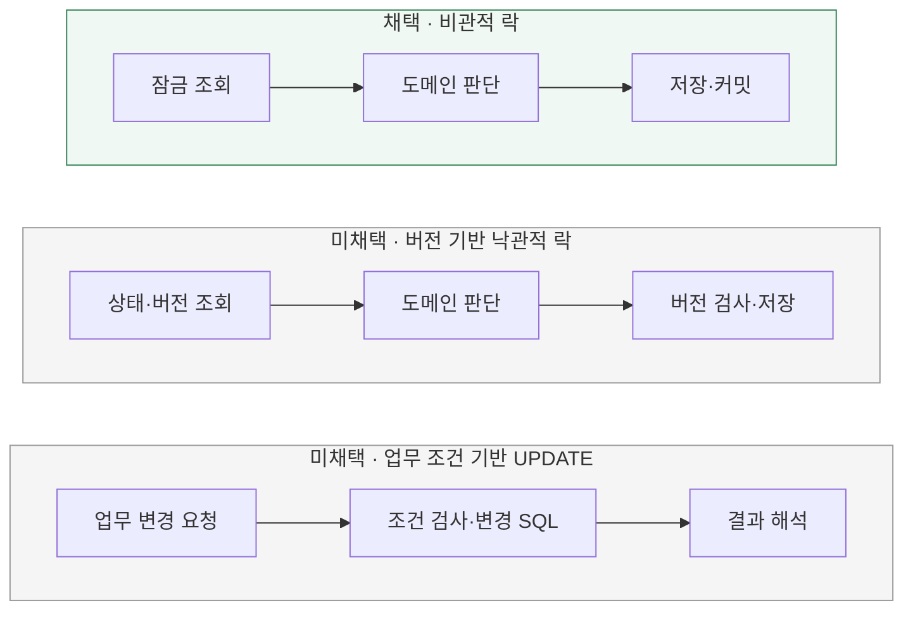

# 동시 변경을 어떤 방식으로 제어할까?

[← 전체 선택 현황](total_trade_off.md)

현재 상태: 채택안을 구현하고 최종 모듈 검사를 통과했다. 설계 당시 비교와 구분되는 실제 검증 범위·남은 한계는 [구현 결과](../result.md)를 따른다.

## 판단할 문제

[순수 도메인 서비스](01-business-policy.md)가 주문·재고·포인트를 판단하는 동안 다른 요청이 같은 데이터를 변경할 수 있다.
도메인 판단의 전제를 보호하는 방법과 충전·관리자 재고 설정 경로까지 적용할 일관된 규칙을 비교한다.
현재 구조와 필수 경쟁 시나리오에서의 구현·검증 복잡도를 기준으로 선택하며 측정하지 않은 성능 우열은 단정하지 않는다.

> **채택 — A. 비관적 락**
>
> 변경할 상태를 잠금 조회한 뒤 도메인 서비스가 업무 규칙을 판단하도록 한다.
> 여러 자원의 변경과 기존 충전·재고 설정 경로에 일관된 보호 규칙을 적용하기 쉽다는 점을 우선한다.
> 잠금 대기·데드락·트랜잭션 길이 관리 비용은 감수한다.

## 흐름 비교

세 흐름 모두 업무 전체의 트랜잭션 안에서 실행하는 설계 대안이다. 구현·검증 완료를 의미하지 않는다.

## 장단점 비교

| 기준 | A. 비관적 락 | B. 버전 기반 낙관적 락 | C. 업무 조건 기반 UPDATE |
|---|---|---|---|
| 보호 방식 | 변경 전 잠금 조회 | 저장 시 예상 버전 검사 | 현재 DB 값에 대한 조건 검사와 변경 |
| 도메인 판단 | 보호된 상태를 바탕으로 판단 | 판단 후 저장 시 전제의 유효성 확인 | 도메인 판단과 실제 DB 결과의 대응 필요 |
| 경쟁 비용 | 잠금 대기·데드락 가능 | 충돌 시 롤백·재판단 비용 | UPDATE 잠금 대기와 변경 0건의 해석 비용 |
| 다른 저장 경로 | 판단 전 잠금 조회 규칙 적용 | 모든 관련 쓰기에 버전 검사·증가 적용 | 충전·최종 수량 설정 등에 맞는 SQL 계약 구성 |
| 현재 구조와의 결합 | 조회·도메인 변경·저장 흐름 유지 용이 | 버전 관리와 JDBC 저장 SQL 보완 필요 | SQL 조건과 도메인 정책의 일치 관리 필요 |

## 옵션별 판단

> **채택 — A:** 현재 도메인 서비스 구조와 여러 자원의 변경을 함께 다루는 요구사항에서 구현·검증 복잡도를 낮춘다. 초기 단계라는 이유만으로 선택하거나 성능 우위를 주장하지 않는다.

> **미채택 — B:** 경쟁이 적으면 유효한 대안이다. 재시도로 사용자에게 충돌을 숨길 수 있지만 응답 지연·추가 부하·한도 초과를 관리해야 한다. 충돌을 곧바로 재고·잔액 부족으로 해석할 수 없다.

> **미채택 — C:** 업무 조건을 SQL에 명시하는 유효한 대안이다. 대중성이나 SQL의 불명확함 때문에 배제하지 않으며, 이번에는 도메인 판단과 DB 변경 결과의 대응·실패 해석 비용을 줄이는 A를 우선한다.

## 적용 전제와 용어

- Infrastructure가 같은 업무 트랜잭션에서 변경 대상의 잠금 조회와 저장을 수행하고, Domain은 잠금 기술을 알지 못한다. Application이 전체 트랜잭션 경계를 관리한다.
- 재고·잔액·주문 상태를 판단하기 전에 필요한 보호를 확보한다. 충전·관리자 재고 설정과 같은 데이터를 쓰는 다른 경로의 우회 가능성도 확인한다.
- 부담은 전체 TPS만으로 판단하지 않는다. 동일 행에 대한 요청 집중도와 잠금 유지 시간이 중요하며, 실제 처리량·지연은 구현 후 확인한다.
- CAS는 예상 값과 일치할 때 변경하는 방식이다. 버전 기반 낙관적 락도 CAS 방식으로 구현할 수 있다. `stock >= quantity` 같은 업무 조건 기반 UPDATE와 구분한다.
- 조건부 UPDATE도 DB 잠금을 사용한다. 비관적 락의 선택만으로 데드락이나 기술 오류가 사라지는 것은 아니다.
- `@Transactional`은 트랜잭션 경계·격리 수준만 정할 뿐 읽기에 락을 걸지 않는다. MySQL 기본 격리수준(REPEATABLE READ)의 평범한 SELECT는 다른 트랜잭션의 쓰기를 막지 못해 갱신 유실이 생길 수 있다 — 재고 5인 상품에 두 트랜잭션이 각각 SELECT로 5를 읽고 각자 -2 계산 후 커밋하면, 실제로는 순차 실행돼야 할 두 차감이 서로를 못 보고 최종 재고가 3(정답 1)이 되는 식이다. `SELECT ... FOR UPDATE`(`@Lock(PESSIMISTIC_WRITE)`)를 쓰면 뒤 트랜잭션의 조회 자체가 앞 트랜잭션이 커밋할 때까지 블록돼 최신값을 보고 계산하게 되므로, 격리 수준과 별개로 명시적 잠금 조회가 필요하다.
- `@Lock(PESSIMISTIC_WRITE)`로 건 행 락은 Hibernate가 임의로 풀어주지 않고 **트랜잭션이 커밋·롤백될 때까지 유지**된다(InnoDB 행 락의 기본 동작). 그래서 잠금 획득 순서가 중요하다 — 두 트랜잭션이 서로 다른 순서로 잠그면(A는 주문→상품, B는 상품→주문) 서로가 서로의 커밋을 기다리는 데드락이 생길 수 있어, 항상 같은 순서(주문→지갑→상품 ID 오름차순)로 잠가 순환 대기를 막는다.
- 트랜잭션이 길어질수록 그 트랜잭션이 쥔 락의 유지 시간도 길어진다. 확정 트랜잭션 안에서 실패를 주입하거나(커밋 5) 여러 worker가 동시에 몰리면(커밋 6~7), 같은 주문·지갑·상품 행을 건드리려는 다른 요청이 그만큼 오래 대기한다 — "잠금 유지 시간이 중요하다"는 위 항목이 가리키는 구체적인 비용이다.

## 구현 계획·검증으로 이어갈 것

트랜잭션 경계·전파는 [Application의 REQUIRED](03-transaction-boundary.md)를 따른다.
[JPA 중심 조회·저장](04-persistence-strategy.md)을 채택했다. 구체적인 잠금 조회 메서드·SQL과 대상별 획득 순서는 구현 계획에서 구체화한다.
대기·실패 처리는 [기존 DB 대기 설정·자동 재시도 없이 전체 롤백](06-failure-handling.md)을 따른다. 격리 수준은 기존 설정을 유지하고, 비교는 [전체 목록의 보류 방침](total_trade_off.md)에 따라 문제 발생 시 재검토한다.
관련 경로의 실제 SQL과 필수 경쟁 사례의 성공·업무 거절·기술 오류 수는 구현 후 검증한다.

[MySQL 잠금 조회](https://dev.mysql.com/doc/refman/8.0/en/innodb-locking-reads.html) ·
[Hibernate 낙관적 잠금](https://docs.hibernate.org/orm/6.6/userguide/html_single/#locking-optimistic)
