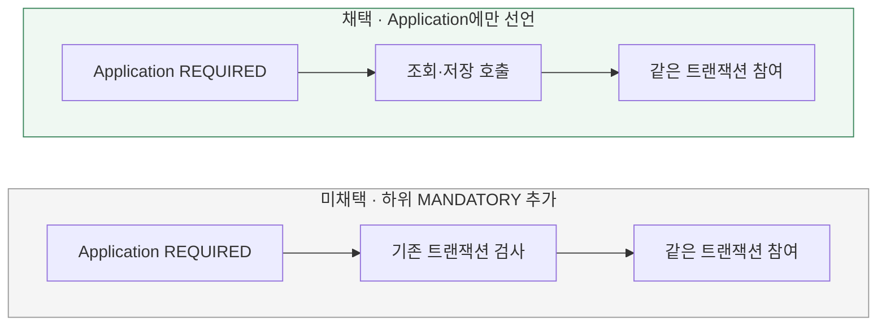

# 트랜잭션 경계와 참여 계약을 어디에 선언할까?

[← 전체 선택 현황](total_trade_off.md)

현재 상태: 채택안을 구현하고 최종 모듈 검사를 통과했다. 설계 당시 비교와 구분되는 실제 검증 범위·남은 한계는 [구현 결과](../result.md)를 따른다.

## 판단할 문제

비관적 잠금 조회부터 도메인 판단·저장까지 같은 트랜잭션으로 묶어야 한다.
Application이 경계를 관리한다는 전제에서 하위 저장 구현에도 트랜잭션 필수 조건을 선언할지 비교한다.
현재 구조를 유지하는 개발 비용과 호출 계약을 실행 시점에 강제하는 이점을 판단 기준으로 삼는다.

> **채택 — A. Application에만 트랜잭션 선언**
>
> Application 진입점에 REQUIRED를 사용하고 하위 조회·저장은 해당 트랜잭션에 참여한다.
> 호출자가 트랜잭션 계약을 지켜야 하는 비용을 감수하고, 추가 프레임워크 설정·테스트 구성·개발 비용을 줄인다.

## 흐름 비교

두 옵션의 정상 호출은 같은 트랜잭션을 사용한다. 차이는 트랜잭션 없이 하위 구현을 호출했을 때의 진입 검사이며, 아래는 설계안이다.

## 장단점 비교

| 기준 | A. Application에만 선언 | B. 하위 MANDATORY 추가 |
|---|---|---|
| 시작 경계 | Application의 REQUIRED | Application의 REQUIRED |
| 정상 호출 | 하위 작업이 기존 트랜잭션에 참여 | 하위 작업이 기존 트랜잭션에 참여 |
| 트랜잭션 없는 하위 호출 | 하위 구현이 진입을 직접 차단하지 않음 | Spring 프록시를 통한 호출이면 예외로 차단 |
| 장점 | 현재 구조 유지, 추가 설정과 개발 비용이 적음 | 트랜잭션 필수 조건을 실행 시점에 강제 |
| 감수 비용 | 호출자가 계약을 지키도록 리뷰·통합 검증 필요 | 하위 구현에 트랜잭션 설정·테스트 구성 추가 |

## 옵션별 판단

> **채택 — A:** 호출 계약 준수는 감수할 만한 비용이다. 트랜잭션 경계를 Application에 집중하고 하위 구현에 추가 선언을 하지 않는 단순함과 낮은 개발 비용을 우선한다.

> **미채택 — B:** 잘못된 호출을 조기에 차단하는 장점은 있지만, 이번에는 이를 위한 추가 설정을 도입하지 않는다. 현재 Infrastructure도 Spring을 사용하므로 A가 프레임워크 의존성을 완전히 제거한다는 의미는 아니다.

## 적용 계약과 검증

- `ConfirmOrderService.execute()`의 REQUIRED 경계를 유지한다. 기존 트랜잭션이 없으면 시작하고, 있으면 참여한다. 외부 트랜잭션에 참여하면 최종 커밋·롤백은 그 외부 경계에서 결정된다.
- 주문 확정용 Infrastructure의 `load()`·`save()`에 MANDATORY를 추가하지 않는다. 호출자는 잠금 조회·도메인 판단·저장을 동일 트랜잭션 안에서 수행해야 한다.
- 조회 메서드만 별도 트랜잭션으로 실행하고 반환 시 종료하는 구성을 허용하지 않는다. 도메인 판단과 저장이 끝나기 전에 잠금이 해제되어서는 안 된다.
- 하위 재고·포인트·주문·기록 저장을 REQUIRES_NEW로 분리하지 않는다. 업무 전체의 원자성을 유지하며 실패는 전체 롤백으로 이어지도록 전파한다.
- Domain과 저장 포트 인터페이스에는 트랜잭션 어노테이션을 추가하지 않는다. 순수 도메인 서비스는 DB·Spring을 알지 못한다.
- 실제 프록시 호출과 [JPA 조회·저장](04-persistence-strategy.md)의 동일 트랜잭션 참여를 구현 시 확인한다. 변경 SQL 실행 후 실패를 유발하고 트랜잭션 종료 후 새 조회로 전체 롤백을 검증한다.

이 결정은 기존 재사용 repository의 트랜잭션 설정을 일괄 제거하거나 변경하자는 뜻이 아니다.
[자동 재시도 없이 전체 롤백](06-failure-handling.md)을 채택했으므로 별도 재시도용 트랜잭션 경계는 추가하지 않는다.

[Spring 전파 타입 설명](https://docs.spring.io/spring-framework/docs/current/javadoc-api/org/springframework/transaction/annotation/Propagation.html)
