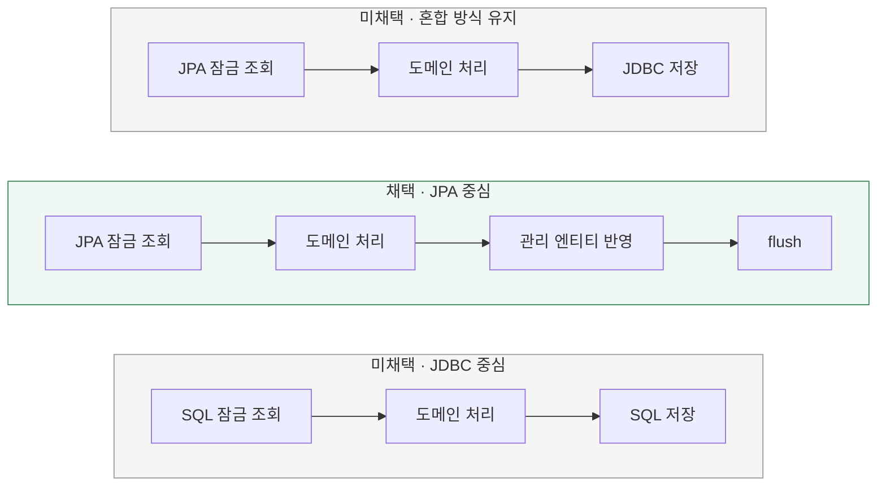

# 주문 확정의 조회·저장을 어떻게 구성할까?

[← 전체 선택 현황](total_trade_off.md)

현재 상태: 채택안을 구현하고 최종 모듈 검사를 통과했다. 설계 당시 비교와 구분되는 실제 검증 범위·남은 한계는 [구현 결과](../result.md)를 따른다.

## 판단할 문제

현재 주문 확정은 JPA repository로 조회한 뒤 JDBC로 변경·기록을 저장하고, 충전·관리자 재고 설정은 JPA로 저장한다.
순수 도메인 서비스와 비관적 락을 유지하면서 혼합 방식을 유지할지, JPA 또는 JDBC 중심으로 맞출지 비교한다.
당장의 변경량과 향후 저장 경로의 일관성·관리 비용을 기준으로 판단한다.

> **채택 — B. JPA 중심으로 조회·저장 통일**
>
> 기존 repository·mapper를 활용하고 충전·재고 설정과 저장 방식을 맞춘다.
> 순수 도메인과 JPA 엔티티의 분리는 유지하며, 주문 확정의 JDBC 저장을 전환하는 비용과 실제 SQL·flush 시점 확인 비용을 감수한다.

## 흐름 비교

아래는 설계 당시의 대안 비교다. 채택안의 실제 구현·검증은 결과 문서를 따른다. 각 흐름은 Application의 동일 트랜잭션 안에서 실행한다.

## 장단점 비교

| 기준 | A. 혼합 방식 유지 | B. JPA 중심 | C. JDBC 중심 |
|---|---|---|---|
| 기존 코드 활용 | JDBC 저장 SQL·배치 처리 유지 | 기존 repository·mapper 활용 | 저장 SQL 유지, 조회·매핑 코드 추가 |
| 상태 관리 | JPA 관리 상태와 직접 변경한 DB 상태의 차이 관리 | 관리 엔티티에 변경을 반영하는 흐름으로 통일 | 해당 경로에서 SQL 결과를 직접 매핑 |
| SQL 표현 | 저장 SQL을 직접 작성 | 생성 SQL·flush 시점 확인 필요 | 조회·저장 SQL을 직접 작성 |
| 관련 경로와 일관성 | 충전·재고 설정의 JPA 저장과 다름 | 기존 JPA 저장 경로와 맞음 | 다른 경로와 구현 방식 차이 또는 추가 전환 비용 |
| 주요 비용 | 오래된 관리 상태 재사용·후속 변경 주의 | 저장 전환과 SQL·배치 동작 검증 | 조회·매핑·SQL 유지보수 |

## 옵션별 판단

> **미채택 — A:** 변경량이 적고 유효한 구조지만, 같은 트랜잭션에서 JPA 관리 상태와 JDBC 변경 결과를 함께 관리하는 비용을 남긴다. 혼합 자체가 원자성을 깨뜨린다는 의미는 아니다.

> **채택 — B:** 현재 순수 도메인 구조를 유지하면서 관련 저장 경로의 일관성을 우선한다. JPA 선택이 SQL 확인을 생략하거나 성능 우위를 보장하지는 않는다.

> **미채택 — C:** SQL 의도를 명시하는 장점이 있지만, 이번에는 조회·매핑 구현을 늘리는 것보다 기존 JPA repository를 활용한다.

## 적용 계약과 검증

- JPA 엔티티를 잠금 조회하고 순수 도메인으로 변환한 뒤, 도메인 서비스가 검증·변경한다. Mapper가 변경을 기존 관리 엔티티에 반영하고 사용·결제 기록도 JPA로 저장한다.
- 순수 도메인에 JPA 어노테이션이나 EntityManager를 추가하지 않는다. Application의 저장 계약 호출은 유지하며 실제 저장 기술은 Infrastructure에 둔다.
- JPA 관리 객체의 변경 감지는 순수 도메인 객체의 변경을 자동으로 반영하지 않는다. 도메인에서 엔티티로의 명시적 매핑이 필요하다.
- flush는 SQL 반영이며 커밋과 다르다. 실패 주입 테스트에서는 실제 변경 SQL이 실행된 뒤 예외를 발생시키고, 트랜잭션 종료 후 별도 조회로 전체 롤백을 검증한다.
- 기존 JDBC 배치와 같은 SQL 수·실행 순서·성능이 유지된다고 가정하지 않는다. 실제 생성 SQL·flush 시점과 변경 대상 외 상태 보존을 확인한다.
- 이 결정은 R02 주문 확정과 관련 변경 경로에 대한 것이다. 기존 GET 조회 DAO나 프로젝트 전체의 JDBC 코드를 JPA로 전환하지 않는다.

구체적인 잠금 조회 메서드, mapper 변경 범위, flush 위치는 구현 계획에서 정한다. 대기·실패 처리는 [기존 DB 대기 설정·자동 재시도 없이 전체 롤백](06-failure-handling.md)을 따른다.
격리 수준 비교는 [전체 목록의 보류 방침](total_trade_off.md)에 따라 이번 PR에서 제외하며, 관련 문제가 확인될 때 재검토한다.

[Hibernate flush 설명](https://docs.hibernate.org/orm/6.6/userguide/html_single/#flushing) ·
[Spring JPA·JDBC 트랜잭션 참여 설명](https://docs.spring.io/spring-framework/docs/current/javadoc-api/org/springframework/orm/jpa/JpaTransactionManager.html)
