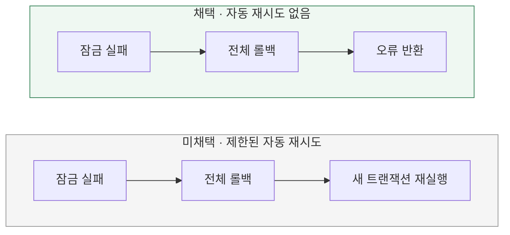

# 잠금 실패 시 자동으로 재시도할까?

[← 전체 선택 현황](total_trade_off.md)

현재 상태: 채택안을 구현하고 최종 모듈 검사를 통과했다. 설계 당시 비교와 구분되는 실제 검증 범위·남은 한계는 [구현 결과](../result.md)를 따른다.

## 판단할 문제

비관적 락도 잠금 대기·데드락·타임아웃이 발생할 수 있다.
실패한 주문 확정을 서버에서 자동 재시도할지, 전체 롤백 후 오류를 반환할지 비교한다.
현재 범위의 개발 비용과 성공 가능성·응답 지연·추가 부하 사이의 균형을 기준으로 판단한다.

> **채택 — 자동 재시도 없이 전체 롤백 후 오류 반환**
>
> 기존 DB 잠금 대기 설정을 사용하고 별도의 대기 제어·자동 재시도 로직을 추가하지 않는다.
> 모든 변경을 동일 트랜잭션에 포함하고 실패를 전체 롤백으로 연결한다. 직접 복구 코드는 작성하지 않는다.
> 일시적인 잠금 실패도 해당 요청의 오류로 반환되는 비용을 감수한다.

## 흐름 비교

아래는 설계안이다. 잠금 해제를 기다리는 동작과 실패한 트랜잭션을 다시 실행하는 재시도는 구분한다.

## 장단점 비교

| 기준 | 자동 재시도 없음 | 제한된 자동 재시도 |
|---|---|---|
| 실패 처리 | 전체 롤백 후 오류 반환 | 전체 롤백 후 새 트랜잭션에서 재판단 |
| 장점 | 실행 경로가 단순하고 추가 개발 비용이 적음 | 일시적인 실패를 흡수해 성공 가능성을 높일 수 있음 |
| 비용 | 일시적인 실패도 요청자에게 노출 | 재시도 대상·한도·대기·트랜잭션 경계 관리 |
| 부하·응답 | 추가 실행 없음, 기존 잠금 대기는 존재 | 재실행에 따른 추가 부하·응답 지연 |

## 옵션별 판단

> **채택 — 자동 재시도 없음:** 현재는 잠금 적용과 전체 롤백을 정확히 구현하는 데 집중한다. 관련 상태를 직접 복구하는 대신 같은 트랜잭션에 참여하도록 보장한다.

> **미채택 — 자동 재시도:** 구현 가능한 대안이지만 현재 필수 기능으로 추가하지 않는다. 실제 실패 빈도와 사용자 영향으로 필요성이 확인될 때 재검토한다.

## 실패 계약과 검증

- 주문 확정의 잠금 조회·도메인 판단·재고 및 포인트 차감·주문 상태·사용 및 결제 기록은 같은 트랜잭션에 포함한다. 일부 작업만 독립 커밋하지 않는다.
- 실패 예외를 삼키지 않고 전체 롤백으로 전파한다. 실제 사용하는 예외가 Spring의 롤백 대상인지 확인하며 checked exception을 도입하면 명시적인 롤백 설정이 필요하다.
- JPA flush와 SQL 실행은 커밋이 아니다. SQL이 실행된 뒤 실패해도 커밋 전 변경 전체를 롤백해야 한다.
- MySQL의 잠금 타임아웃은 기본적으로 실패한 SQL만 롤백할 수 있다. DB의 부분 롤백에 기대지 않고 Application 트랜잭션 전체가 롤백되도록 한다.
- 실패한 최초 확정 시도의 DRAFT와 기존 재고·잔액·기록을 보존한다. 다른 요청이 이미 성공적으로 확정한 주문을 DRAFT로 되돌리지 않는다. 직접 복구 UPDATE나 보상 차감·충전 코드를 추가하지 않는다.
- 잠금 오류를 재고·잔액 부족으로 바꾸지 않고 기술 오류로 구분한다. 기존 오류 응답 경로와 예외 전파는 구현 계획에서 확인한다.
- 필수 경쟁 사례의 기술 오류 0건 기준은 유지한다. 오류가 발생하면 잠금 순서·트랜잭션 길이·실제 SQL을 점검하며 DRAFT 보존만으로 통과시키지 않는다.
- 실제 변경 SQL 이후 실패·트랜잭션 종료·새 조회를 통해 전체 롤백을 검증한다. 테스트 worker의 제한 시간과 자원 정리 기준은 유지한다.

[MySQL 오류 처리](https://dev.mysql.com/doc/refman/8.0/en/innodb-error-handling.html) ·
[Spring 롤백 규칙](https://docs.spring.io/spring-framework/reference/data-access/transaction/declarative/rolling-back.html)
