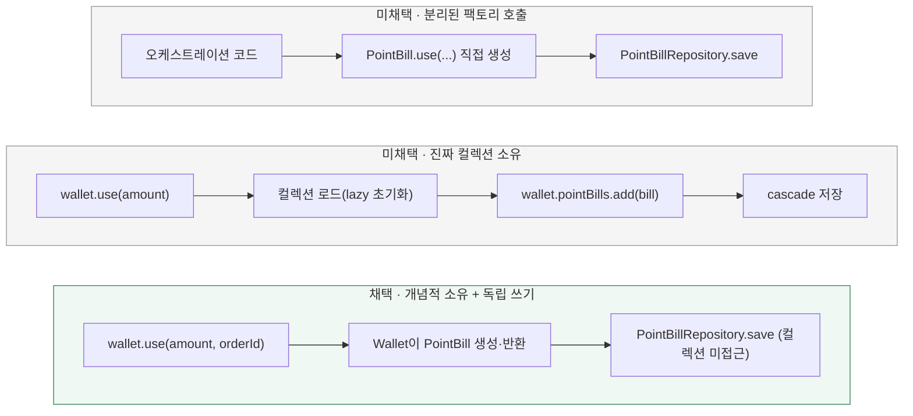

# 사용자 잔액 도메인을 어떻게 모델링할까? (Point → Wallet)

[← 전체 선택 현황](total_trade_off.md)

현재 상태: 채택안을 구현하고 최종 모듈 검사를 통과했다. 설계 당시 비교와 구분되는 실제 검증 범위·남은 한계는 [구현 결과](../result.md)를 따른다.

## 판단할 문제

주문 확정과 포인트 충전이 같은 사용자 잔액 행을 잠그고 변경한다. 이 정합성 작업을 계기로 잔액 도메인의 이름·이력(Bill) 생성 책임·값 객체 구조를 함께 정리할지, 그대로 두고 락·검증만 얹을지 결정한다.
2단계(검증 후 변경) 검증 자체는 이 결정과 무관하게 필요하지만, "확정 트랜잭션이 포인트 이력 전체를 불필요하게 로드하지 않는다"는 제약을 지키면서 도메인 이름·책임을 명확히 하는 방향으로 세 가지를 함께 결정했다.

> **채택 — 이름은 Wallet, PointBill은 그대로, 이력은 개념적 소유 + 독립 쓰기, 새 VO 계층은 만들지 않음**
>
> `Point` → `Wallet`로 domain/application/infrastructure/interfaces 전 계층과 DB `points` 테이블을 전환한다. 기존 HTTP 계약(`/api/v1/points/*`)은 그대로 유지한다.
> `PointBill`은 클래스명·테이블명(`point_bills`)을 바꾸지 않는다 — Wallet(계좌)이 담고 있는 단위가 Point(포인트)이므로 "포인트 사용/충전 기록"이라는 이름은 여전히 맞다.
> `Wallet.charge(Money)`/`Wallet.use(Money, orderId)`가 각각 `PointBill`을 직접 생성해 반환한다(애그리거트가 자기 이력을 만들 책임을 짐 — 개념적 소유). 다만 영속화는 Wallet의 JPA 컬렉션을 통하지 않고 `PointBillRepository`로 독립적으로 insert한다.
> `Money`를 상속하는 별도 VO 계층은 만들지 않는다. Wallet 잔액은 `Money`를 그대로 재사용한다.

## 흐름 비교 (PointBill 소유 방식)

## 장단점 비교

| 기준 | A. 분리된 팩토리 호출(현행) | B. 진짜 컬렉션 소유 | C. 개념적 소유 + 독립 쓰기(채택) |
|---|---|---|---|
| 책임 소재 | 오케스트레이션 쪽이 "언제 기록을 남길지" 결정 | Wallet 애그리거트가 전적으로 책임 | Wallet이 기록 생성 책임을 지되 영속화는 분리 |
| 확정 트랜잭션 비용 | 영향 없음(Wallet과 무관) | `use()` 호출 시 컬렉션 초기화 필요 → 사용자 이력 전체 로드 | 컬렉션을 만지지 않으므로 로드 없음 |
| JPA 매핑 복잡도 | 없음 | `@OneToMany(cascade=PERSIST)` + lazy 로딩·N+1 관리 필요 | 기존 `PointBillRepository.save` 그대로 재사용 |
| 도메인 표현력 | Wallet이 자기 이력의 존재를 모름 | 애그리거트 경계와 일치(가장 DDD 정석) | Wallet이 "무엇을 기록해야 하는지"는 알지만 저장 방식은 모름 |
| 이력 조회 API | 기존 `PointQueryDao`류로 별도 조회 | Wallet을 통해 조회 가능(단, locking 경로에선 여전히 회피해야 함) | 기존처럼 별도 조회 유지 |

## 옵션별 판단

> **미채택 — A:** 지금 코드가 이 형태다. 문제 없이 동작하지만 "잔액이 바뀌면 반드시 기록이 남는다"는 불변식이 Wallet이 아니라 호출자(서비스)의 규율에 의존한다.

> **미채택 — B:** 애그리거트 경계상 가장 정석이지만, 비관적 락으로 보호해야 하는 바로 그 트랜잭션(주문 확정)에서 사용자의 포인트 이력 전체를 로드하게 만드는 비용이 R02가 줄이려는 문제(불필요한 락 유지 시간)와 정면으로 부딪힌다.
> `@OneToMany` 컬렉션에 `add()`하려면 Hibernate가 먼저 그 컬렉션을 초기화(로드)해야 하므로, "쓰기 전용으로 lazy 컬렉션을 안 건드린다"는 회피책 자체가 성립하지 않는다.

> **채택 — C:** Wallet이 "이 변경엔 반드시 기록이 따른다"는 불변식을 스스로 강제(팩토리를 자기 자신에게 위임)하면서도, 영속화는 독립 저장소로 남겨 확정 트랜잭션의 락 유지 시간에 영향을 주지 않는다. 이력 조회 기능이 필요해지면 그때 별도 QueryDao로 확장한다.

## 이름 변경 범위

- `domain.pay.point` → `domain.pay.wallet` 패키지 이동. `Point`→`Wallet`, `PointRepository`→`WalletRepository`. `PointBill`/`PointBillRepository`는 이름을 유지한 채 같은 패키지로 이동한다.
- `application.pay.point` → `application.pay.wallet`. `PointService`→`WalletService`, `ChargePointUseCase`→`ChargeWalletUseCase`, `PointCommand`→`WalletCommand`, `PointResult`→`WalletResult`, `PointQueryDao`→`WalletQueryDao`.
- `infrastructure.pay.point` → `infrastructure.pay.wallet`. `PointJpaEntity`→`WalletJpaEntity`(테이블 `points`→`wallets`, 컬럼명은 유지), `PointJpaRepository`→`WalletJpaRepository`, `PointRepositoryImpl`→`WalletRepositoryImpl`, `PointEntityMapper`→`WalletEntityMapper`, `JdbcPointQueryDao`→`JdbcWalletQueryDao`. `PointBillJpaEntity`(테이블 `point_bills` 유지)/`PointBillJpaRepository`/`PointBillRepositoryImpl`/`PointBillEntityMapper`는 이름을 유지한 채 같은 패키지로 이동한다.
- `interfaces.api.pay.point` → `interfaces.api.pay.wallet`. `PointController`→`WalletController`, `PointQueryController`→`WalletQueryController`, `PointApiDto`→`WalletApiDto`. **`@RequestMapping` 경로(`/api/v1/points`, `/api/v1/points/charge`)와 요청/응답 필드는 변경하지 않는다.**
- `ddl-auto: create`(로컬/테스트 프로필)이며 별도 마이그레이션 도구가 없어 테이블명 변경 비용은 낮다. `prd` 프로필은 `ddl-auto: none`이라 실제 배포 스키마는 이 저장소 범위 밖(과제 성격상 실 운영 반영 불필요)이다.

## Money 상속 VO 미도입 근거

`Money.java` 확인 결과 구조적 검증(음수 금지)은 이미 `Money`가, 업무 규칙(잔액 부족)은 `Point`(신규 `Wallet`)가 담당하는 구조였다(`Point.use()`가 직접 `amount > balance` 검사 후 `Money.of(...)`로 재구성). 2단계 검증에 필요한 건 `Wallet.ensureSufficientBalance(Money)` non-mutating 메서드 하나뿐이며, 잔액이 가격·주문총액과 다른 산술 규칙을 가질 근거가 없어 새 VO 계층을 만들지 않는다.

## 구현 계획·검증으로 이어갈 것

이 결정은 [구현 계획](../plan.md)의 새 커밋 1(Point→Wallet 전환)로 먼저 진행하고, 기존 커밋 1~7은 커밋 2~8로 이어간다.
`Stock.ensureCanDecrease(int)`/`Wallet.ensureSufficientBalance(Money)` non-mutating 검증과 `Wallet.use(...)`가 `PointBill`을 생성해 반환하는 방식은 새 커밋 2(옛 커밋 1, 도메인 규칙 분리)에서 함께 구현한다.
`OrderBill` 생성 책임은 이 문서가 다루는 범위가 아니다 — [Order/OrderBill의 컨텍스트 경계](08-bill-creation-boundary.md)에서 별도로 정리했다.
