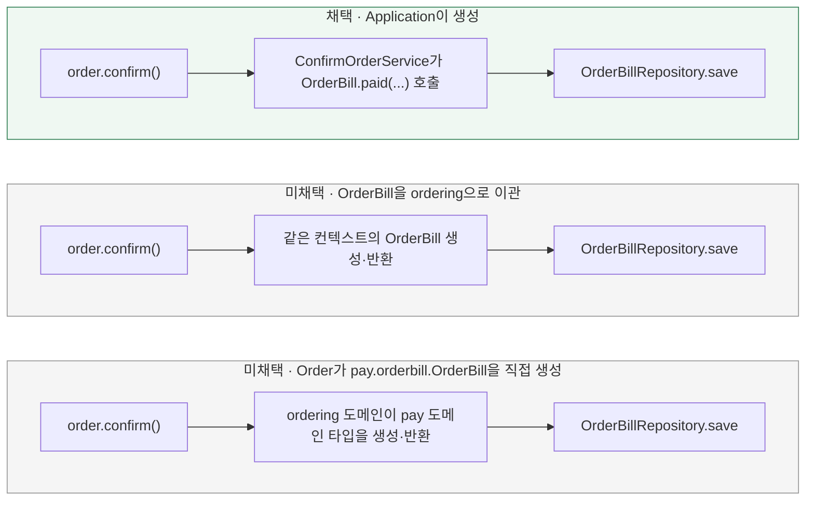

# OrderBill 생성 책임은 어디에 둘까? (컨텍스트 경계)

[← 전체 선택 현황](total_trade_off.md)

현재 상태: 채택안을 구현하고 최종 모듈 검사를 통과했다. 설계 당시 비교와 구분되는 실제 검증 범위·남은 한계는 [구현 결과](../result.md)를 따른다.

## 판단할 문제

[Wallet 모델링](07-wallet-model.md)에서 "애그리거트가 자기 이력을 만들어 반환한다"(옵션 C)를 채택하면서, 같은 논리를 `Order.confirm()`이 `OrderBill`을 만들어 반환하는 데도 적용하기로 했었다.
그런데 애그리거트는 하나의 바운디드 컨텍스트 안에서만 성립하는 개념이다. `Wallet`과 `PointBill`은 둘 다 `pay.wallet` 컨텍스트 소속이라 "애그리거트가 자기 기록을 만든다"는 말이 성립하지만,
`Order`는 `ordering` 컨텍스트, `OrderBill`은 `pay.orderbill` 컨텍스트 소속이라 `Order.confirm()`이 `OrderBill`을 직접 생성하는 것은 애초에 "애그리거트의 자기 책임"이라고 부를 수 없다 — 다른 컨텍스트의 애그리거트를 대신 만드는 월권이다.
이 문서는 `OrderBill` 생성 책임을 어디에 둘지 다시 정한다.
추가로, "포인트 차감 시 스냅샷으로 `PointBill`이 생기듯 주문 확정 시 스냅샷으로 `OrderBill`이 생기니 `OrderBill`도 `ordering`으로 옮겨야 하지 않나"는 대칭성 제안도 함께 검토했다(옵션 B).

> **채택 — A. Application(ConfirmOrderService)이 생성 (현행 유지)**
>
> `Order.confirm()`은 상태만 바꾸고 아무것도 반환하지 않는다. `OrderBill.paid(orderId, userId, amount)`는 지금처럼 `ConfirmOrderService`(application, ordering 컨텍스트)가 호출해 생성한다.
> 이미 존재하던 방식이며, 여러 애그리거트(Order/Product/Wallet/OrderBill)를 한 트랜잭션으로 조율하는 responsibility는 application 계층의 정상적인 역할이다.

## 흐름 비교

## 장단점 비교

| 기준 | A. Application이 생성(채택) | B. OrderBill을 ordering으로 이관 | C. Order가 pay 타입을 직접 생성 |
|---|---|---|---|
| 무엇을 표현하는가 | `OrderBill`은 "결제됐다"는 금전적 사실 — `Order.status`(DRAFT/CONFIRMED)와는 다른 층위 | 트리거 시점(주문 확정)을 기준으로 소속을 정함 — 표현 내용(결제 사실)과 컨텍스트가 어긋남 | 동일 |
| 컨텍스트 경계 | 지킴 — 각 도메인은 자기 컨텍스트 타입만 다룸 | 지킴 — 이관하면 같은 컨텍스트가 됨 | 깨짐 — ordering 도메인이 pay 도메인 타입에 의존 |
| 기존 컨벤션 | 변경 없음(원래도 이 방식) | [week2 도메인 모델](../../../week2/04-domain-model.md)·[pr-05 계획](../../../week2/pr-05-order-create-query-plan.md)의 "결제 조회용 Pay 소유 OrderBill 저장 구조"와 정면 충돌, `JdbcOrderQueryDao`의 `order_bills` 조인 전제 재검토 필요 | 변경 없음 |
| 구현 범위 | R02 범위 내, 커밋 2에서 추가 변경 없음 | 패키지 이동 + read model·문서 전반 재조정 — R02 범위를 크게 벗어남 | Order.confirm() 시그니처 변경, 컨텍스트 경계 위반을 코드에 고착 |
| DDD 원칙 | 애플리케이션 서비스가 여러 애그리거트를 조율하는 표준 패턴 | 애그리거트 자기 책임 원칙은 지키지만 "트리거 시점 = 소유 컨텍스트"라는 잘못된 전제에 기반 | "애그리거트가 만든다"는 표현 자체가 성립하지 않음(범주 오류) |

## 옵션별 판단

> **채택 — A:** `OrderBill.paid(...)`는 이미 `pay.orderbill` 패키지의 순수 도메인 정적 팩토리다. "생성 로직"은 이미 올바른 컨텍스트(pay)에 있고, application은 언제 호출할지만 조율한다 — 이건 컨텍스트 경계를 지키는 정상적인 조율이지, 책임 회피가 아니다.

> **미채택 — B:** "충전/사용 시 `PointBill`이 생기듯 확정 시 `OrderBill`이 생기니 같은 컨텍스트로 옮기자"는 제안은 자연스러워 보이지만, `PointBill`이 Wallet과 같은 컨텍스트인 진짜 이유는 "Wallet 변경 때 생겨서"가 아니라 **둘 다 같은 종류(금전 기록)라서**다. 같은 기준을 적용하면 `OrderBill`도 "결제 사실"을 기록하는 것이므로 오히려 Pay 쪽 소속이 맞다 — `Order`는 이미 `status`로 자기 상태(DRAFT/CONFIRMED)를 갖고 있고, `OrderBill`은 그와 별개인 Pay의 사실이다.
> 비유: 주문 확정은 `Product.decreaseStock()`도 트리거하지만, 그렇다고 재고 차감 로직을 `ordering`으로 옮기지 않는다 — 재고는 여전히 `mall`(Product) 소관이고 `Order`는 그걸 호출만 한다. "무엇을 트리거하느냐"가 아니라 "그 데이터가 무엇을 표현하느냐"가 소속을 정한다.
> 이 설계는 우연이 아니라 의도적이다 — [pr-05 계획 문서](../../../week2/pr-05-order-create-query-plan.md)가 "**결제 조회용 저장 구조 (Pay 컨텍스트, OrderBill)**"라고 명시하며 "Pay 소유의 OrderBill 저장·조회 구조"를 못 박아뒀고, `JdbcOrderQueryDao`가 `order_bills`를 LEFT JOIN해 주문 조회에 결제 상태를 노출하는 것도 이 설계를 전제로 이미 동작한다.

> **미채택 — C:** [Wallet 모델링](07-wallet-model.md)에서 처음 이렇게 정했던 결정을 재검토한 결과다. 애그리거트는 하나의 컨텍스트 안에서만 성립하므로 `Order`가 `pay.orderbill.OrderBill`을 만드는 것은 "애그리거트의 책임"이 아니라 컨텍스트 경계 위반이다.

## 적용 전제와 용어

- **원칙: 소속은 "무엇을 표현하는가"로 정하지 "언제 트리거되는가"로 정하지 않는다.** `OrderBill`이 주문 확정 시점에 생긴다는 사실이 곧 `ordering` 소속을 의미하지 않는다.
- `PointBill`(Wallet 소속, [07번 문서](07-wallet-model.md))과 `OrderBill`(Pay-orderbill 소속, 본 문서)은 생성 책임 소재가 다르게 유지된다 — 이는 비일관성이 아니라 "둘 다 금전 기록이라 Pay가 모은다"는 같은 원칙의 일관된 적용이다.
- `Order.confirm()`은 [Wallet 모델링 결정](07-wallet-model.md) 이전 원래 시그니처(반환값 없음)로 되돌린다.

## 구현 계획·검증으로 이어갈 것

[구현 계획](../plan.md) 커밋 2(도메인 규칙 분리)의 TODO에서 "`Order.confirm(...)`이 `OrderBill`을 생성해 반환하도록 한다"를 제거하고, `OrderBill` 생성은 지금처럼 `ConfirmOrderService`가 담당하는 것으로 수정한다.
`Wallet.use(Money, long orderId)`가 `PointBill`을 생성해 반환하는 부분은 [07번 문서](07-wallet-model.md)의 결정대로 유지한다.
