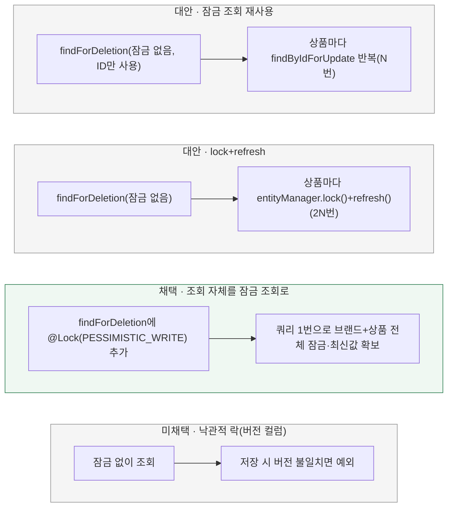

# 브랜드 일괄 삭제가 상품 잠금을 어떻게 확보할까?

[← 전체 선택 현황](total_trade_off.md)

현재 상태: 채택안을 구현하고 최종 모듈 검사를 통과했다. 설계 당시 비교와 구분되는 실제 검증 범위·남은 한계는 [구현 결과](../result.md)를 따른다.

## 판단할 문제

`BrandRepositoryImpl.findForDeletion(brandId)`는 브랜드와 소속 상품 전체를 `LEFT JOIN FETCH`로 한 번에 읽지만 잠금이 없다. `BrandRepositoryImpl.save(brand)`는 저장 직전에 상품을 `productJpaRepository.findById(...)`로 다시 조회하지만, 실제로 엔티티에 반영하는 값은 `findForDeletion` 시점에 읽어 도메인 객체에 담긴 **오래된 값**이다.
MySQL 기본 격리수준(REPEATABLE READ)에서는 같은 트랜잭션 안의 평범한(잠금 없는) 조회가 트랜잭션 시작 시점의 스냅샷을 계속 보여준다 — 저장 직전에 "다시" 조회해도 그 사이 다른 트랜잭션이 커밋한 최신값은 보이지 않는다. 그래서 주문 확정이 동시에 같은 상품 재고를 차감·커밋해도 브랜드 삭제 저장이 그 변경을 못 보고 자신이 처음 읽은 낡은 재고 값으로 덮어써 버릴 수 있다(갱신 유실). 이 문서는 그 사이에 비관적 락을 어떻게 확보할지 정한다.

> **채택 — C. `findForDeletion` 조회 자체에 `@Lock(PESSIMISTIC_WRITE)`를 적용**
>
> 브랜드+상품을 읽어오는 `LEFT JOIN FETCH` 쿼리 자체에 비관적 쓰기 잠금을 걸어 한 번의 쿼리로 브랜드 행과 상품 행 전체를 동시에 잠그고 최신값을 읽는다.
> [`BrandFindForDeletionLockIntegrationTest`](../../../../apps/commerce-api/src/test/java/com/loopers/infrastructure/mall/brand/BrandFindForDeletionLockIntegrationTest.java)로 실제 검증했다 — 별도 커넥션에서 같은 상품 행을 `innodb_lock_wait_timeout=1`로 짧게 잠금 조회를 시도하면 타임아웃으로 실패한다. 즉 이 Hibernate·MySQL 조합에서는 `fetch join`한 자식(Product) 행까지 잠금이 정상적으로 걸린다.

## 흐름 비교

## 장단점 비교

| 기준 | A. 잠금 조회 재사용 | B. lock+refresh | C. 조회 자체를 잠금(채택) | D. 낙관적 락 |
|---|---|---|---|---|
| SQL 왕복(상품 N개 기준) | 1(브랜드+상품, 무잠금) + N(잠금 조회) | 1(무잠금) + 2N(lock + refresh) | **1**(브랜드+상품, 잠금 포함) | 1(무잠금) — 대신 저장 시 충돌 가능 |
| 새 기술 도입 | 없음(커밋 3 코드 재사용) | `EntityManager` 직접 사용(신규) | 없음(`@Lock` + `@Query` — 커밋 3와 동일 어노테이션 조합) | `@Version` 컬럼 신규 |
| 검증 난이도 | 낮음(단위 테스트로 호출 확인, 기존 코드) | 높음(DB 없이 lock/refresh 상호작용 확인 어려움) | 중간(컬렉션 fetch join + 잠금 조합이 실제로 자식 행까지 잠그는지 실측 필요) | 낮음(버전 불일치 예외만 확인) |
| 프로젝트 전략 일치 | 일치(비관적 락) | 일치(비관적 락) | 일치(비관적 락) | 불일치 — [02-concurrency-control.md](02-concurrency-control.md)에서 이미 비관적 락 채택 |
| 초기 조회 낭비 | 있음(상품 컬럼값 버리고 재조회) | 없음 | 없음 | 없음 |

## 옵션별 판단

> **채택 — C:** SQL 왕복이 가장 적고 커밋 3와 같은 `@Lock`+`@Query` 조합을 재사용해 새 기술도 안 늘어난다. `LEFT JOIN FETCH`로 가져오는 컬렉션(`b.products`)에 잠금을 같이 걸면 Hibernate 구현에 따라 루트(Brand)만 잠기고 자식(Product)은 안 잠길 위험이 있었지만, 통합 테스트로 상품 행까지 실제로 잠긴다는 걸 확인했다.

> **미채택 — A:** C가 검증되지 않았을 경우의 대체안이었다. 커밋 3에서 이미 검증된 `ProductRepository.findByIdForUpdate`를 재사용해 안전하지만, 상품마다 별도 쿼리가 필요해 SQL 왕복이 C보다 많다. C가 그대로 동작함을 확인해 채택하지 않는다.

> **미채택 — B:** `entityManager.lock()`은 락만 걸고 필드 값을 갱신하지 않아 `refresh()`를 반드시 함께 호출해야 한다. 상품당 SQL이 2배로 늘고, `EntityManager`를 직접 쓰는 첫 사례가 되어 검증·유지보수 부담이 A·C보다 크다.

> **미채택 — D:** 기술적으로 가능하지만 R02 전체가 이미 [비관적 락](02-concurrency-control.md)을 채택했다. 이 한 경로만 낙관적 락(버전 충돌 시 예외)으로 가면 동시성 제어 전략이 갈려 일관성이 깨진다.

## 적용 전제와 용어

- **문제의 핵심은 "저장 시 재조회"가 아니라 격리수준이다.** REPEATABLE READ에서 잠금 없는 재조회는 트랜잭션 시작 시점 스냅샷을 반환하므로, 동시에 커밋된 변경을 못 본다. 잠금 조회(`FOR UPDATE`)만이 항상 최신 커밋값을 강제로 읽는다.
- 브랜드 삭제는 주문 확정과 달리 "상대방이 먼저 끝났다고 자신이 실패하는" 업무 규칙이 없다 — 항상 대기 후 성공한다(연관 상품 존재로 삭제를 거절하는 규칙은 R01에서 이미 제거됨). 반대로 주문 확정은 "이미 삭제된 상품이면 거절"하는 규칙이 있어 비대칭적으로 실패할 수 있다.
- 검증은 두 개의 실제 DB 커넥션(스레드)으로 한쪽이 `findForDeletion`을 호출해 트랜잭션을 연 채 유지하고, 다른 쪽이 같은 상품 행에 짧은 `innodb_lock_wait_timeout`으로 잠금 조회를 시도해 대기/타임아웃하는지로 확인한다.

## 구현 계획·검증으로 이어갈 것

[구현 계획](../plan.md) 커밋 4에 이 결정을 반영한다. `BrandJpaRepository.findForDeletion`에 `@Lock(PESSIMISTIC_WRITE)`만 추가했고, `BrandRepositoryImpl.save`의 재조회 로직은 그대로 둔다(저장 시점엔 이미 findForDeletion이 잠근 최신 상태를 그대로 쓰므로 문제 없음).
