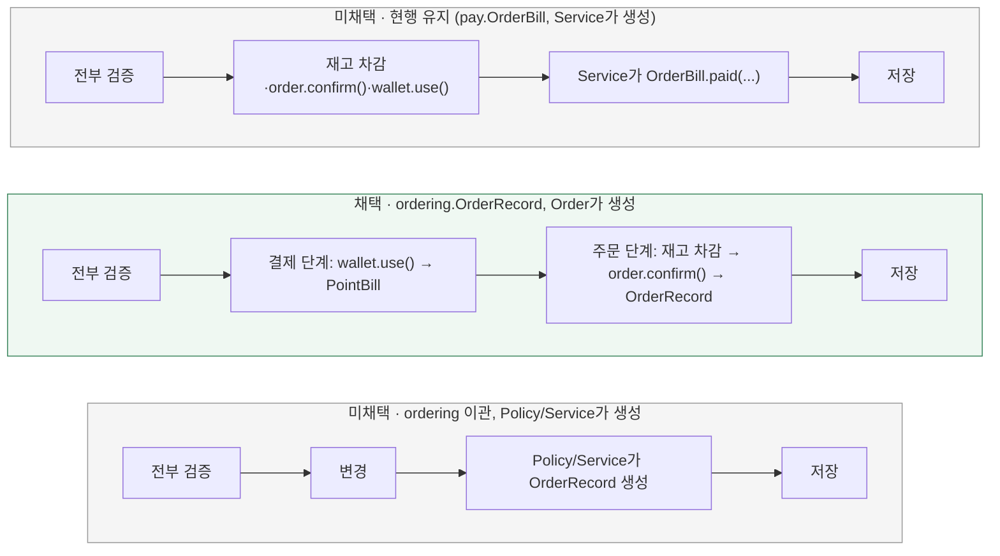

# 주문 확정 기록은 누가 소유할까? (OrderBill → OrderRecord)

[← 전체 선택 현황](total_trade_off.md) · [이전 결정: 08 OrderBill 생성 책임](08-bill-creation-boundary.md) · [패키지 리팩토링 결정 기록](../../../refactor/context-notes.md)

> 후속 결정: [11번 주문 기록의 애그리거트 경계](11-order-record-aggregate.md)에서 `OrderRecord`를 `Order` 애그리거트 안으로 옮겼다. `Order.confirm()`은 기록을 반환하지 않고 내부에 보관하며, 독립 저장소는 없어진다.

현재 상태: 패키지 구조 리팩토링(`volume-3/refacto`) 중 사용자와 문답으로 합의했다. 구현은 `volume-3/refacto-order-record` 브랜치에서 진행한다.

## 판단할 문제

[08번](08-bill-creation-boundary.md)은 `OrderBill`을 "결제됐다는 금전 사실"로 보고 pay 소속을 유지했다(ordering 이관은 미채택).
그런데 주문 확정에서 금전 사실은 이미 `Wallet.use()`가 만드는 `PointBill(USE, orderId)`가 기록한다. 같은 금액·주문 ID를 두 곳에서 "결제 사실"로 기록하고 있는 셈이다.
그래서 `OrderBill`이 표현하는 것을 "결제 사실"이 아니라 "이 주문이 확정됐다는 주문의 사실"로 다시 정의하고, 그 기준으로 소속과 생성 책임을 다시 정한다.

> **채택 — B. ordering 소유의 OrderRecord로 이관하고, Order.confirm()이 생성·반환**
>
> 결제 사실(영수증)은 `PointBill(USE)`이 맡고, 주문 확정 사실은 ordering 컨텍스트의 `OrderRecord`가 맡는다.
> `Wallet.use()`가 `PointBill`을 반환하듯 `Order.confirm()`이 `OrderRecord`를 반환해 두 컨텍스트의 기록 생성 방식을 대칭으로 맞춘다.
> 확정 흐름은 "전부 검증 → 결제 단계(지갑 차감 → 영수증) → 주문 단계(재고 차감 → 주문 확정 → 주문 기록)"로 읽히게 정리한다.
> 감수하는 비용: 08번 결정과 week2 문서의 "Pay 소유 OrderBill" 전제가 바뀐다. 상태값은 `PAID` 그대로 두므로 주문의 사실을 표현하는 이름으로는 다소 어색함이 남는다.

## 흐름 비교

## 장단점 비교

| 기준 | A. 현행 유지 | B. OrderRecord + Order가 생성(채택) | C. OrderRecord + Policy/Service가 생성 |
|---|---|---|---|
| 무엇을 표현하는가 | 결제 사실 — PointBill(USE)과 의미가 겹침 | 주문 확정 사실 — 결제 사실(PointBill)과 역할이 나뉨 | B와 같음 |
| 컨텍스트 경계 | 지킴 | 지킴 — 같은 컨텍스트 안에서 애그리거트가 자기 기록을 만듦 | 지킴 |
| 생성 방식의 일관성 | Wallet은 자기 기록을 만들고 Order는 만들지 않는 비대칭 | `wallet.use()→PointBill`, `order.confirm()→OrderRecord` 대칭 | 여전히 비대칭 |
| 흐름 가독성 | 검증 후 변경이 한 덩어리 | 결제 단계와 주문 단계가 구분되어 읽힘 | 단계 구분은 가능 |
| 변경 범위 | 없음 | 패키지·이름·테이블(`order_records`)·확정 흐름·관련 테스트, 08번·week2 전제 갱신 | B보다 도메인 시그니처 변경이 적음 |
| API 계약 | 불변 | 불변 — `paymentAmount`, `paymentStatus: PAID` 유지 | 불변 |

## 옵션별 판단

> **미채택 — A:** 08번은 "소속은 무엇을 표현하느냐로 정한다"는 원칙으로 pay를 택했다. 원칙은 유지하되, 표현 대상을 다시 보면 결제 사실은 이미 `PointBill(USE)`이 기록한다. `OrderBill`을 결제 사실로 두면 같은 사실을 두 번 기록하게 된다.

> **채택 — B:** 표현 대상을 "주문이 확정됐다"로 정의하면 08번과 같은 원칙에 따라 ordering 소속이 맞다. 같은 컨텍스트가 되므로 08번이 옵션 C를 거절한 이유(다른 컨텍스트 애그리거트를 대신 만드는 월권)가 더는 성립하지 않고, `Order.confirm()`이 자기 기록을 반환할 수 있다.
> 검증 순서(주문 상태 → 상품별 재고 → 잔액)와 오류 우선순위는 그대로 두고, 모든 검증을 통과한 뒤에만 결제 단계와 주문 단계의 변경을 수행한다. 실패 시 트랜잭션 전체 롤백도 그대로다.

> **미채택 — C:** 소속은 B와 같지만 생성 책임을 Policy나 Service에 두면 `Wallet`/`PointBill`과의 비대칭이 남는다. 같은 컨텍스트라면 애그리거트가 자기 기록을 만드는 [07번](07-wallet-model.md)의 원칙을 그대로 적용하는 편이 일관된다.

## 적용 전제와 용어

- 이름: `OrderBill` → `OrderRecord`, `OrderBillStatus` → `OrderRecordStatus`(값 `PAID` 유지), `OrderBillRepository` → `OrderRecordRepository`. 필드(orderId, userId, amount, status, createdAt)는 그대로다.
- 위치: `domain.ordering.{model,repository}`, `infrastructure.persistence.ordering.{entity,jpa,repository}`.
- 테이블: `order_bills` → `order_records`, 유니크 제약 `uk_order_records_order_id`. local·test는 `ddl-auto: create`라 마이그레이션이 없다.
- 영수증: 새 타입을 만들지 않는다. 기존 `PointBill(USE)`이 결제 영수증이다.
- `Order.confirm()`은 `OrderRecord`를 반환한다. [08번](08-bill-creation-boundary.md)의 "반환값 없음" 결정을 대체한다.
- 주문 조회 API의 `paymentAmount`·`paymentStatus` 응답 형태는 바뀌지 않는다.

## 구현 계획·검증으로 이어갈 것

구현은 두 커밋으로 나눈다. 먼저 동작 변경 없이 이관·이름·테이블만 바꾸고, 다음 커밋에서 확정 흐름을 결제 단계와 주문 단계로 나누며 `Order.confirm()`이 `OrderRecord`를 반환하게 한다.
테스트는 이름·시그니처 변경에 따른 수정과 새 동작(`Order.confirm()` 반환값) 검증 추가만 허용하고, 오류 우선순위·롤백·동시성 결과 같은 행위 기대값은 바꾸지 않는다.
검증 범위는 ordering·pay 관련 단위·통합 테스트, 주문 API E2E, ArchUnit이다.
