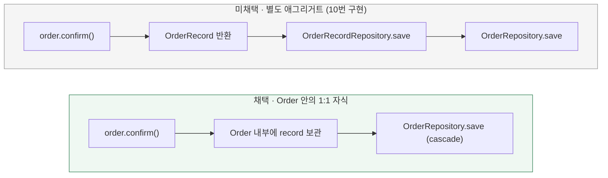

# 주문 기록을 주문 애그리거트 안에 둘까? (Order ↔ OrderRecord 1:1)

[← 전체 선택 현황](total_trade_off.md) · [이전 결정: 10 주문 확정 기록 소유](10-order-record-ownership.md) · [패키지 리팩토링 결정 기록](../../../refactor/context-notes.md)

현재 상태: 패키지 구조 리팩토링 중 사용자와 문답으로 합의했다. 구현은 `volume-3/refacto-order-aggregate` 브랜치에서 진행한다.

## 판단할 문제

[10번](10-order-record-ownership.md)에서 `OrderRecord`를 ordering 소속으로 옮기고 `Order.confirm()`이 이를 반환하게 했다.
하지만 `OrderRecord`는 여전히 독립 저장소(`OrderRecordRepository`)를 가진 별도 애그리거트였고, `orderId` 숫자로만 주문을 가리켰다.
주문 기록은 주문 없이는 의미가 없고 주문당 하나뿐이며 주문 확정과 같은 순간에만 생긴다. 그래서 주문 애그리거트의 일부로 두고 루트를 통해서만 만들고 저장할지 정한다.

> **채택 — B. Order 애그리거트 안의 1:1 자식 엔티티로 관리**
>
> `Order`가 `OrderRecord record`를 필드로 들고(DRAFT면 없음), `confirm()`이 상태 변경과 함께 내부에서 기록을 만든다. 조회는 `order.getRecord()`로 한다.
> `OrderRecordRepository`는 없애고 `OrderRepository.save`가 JPA cascade로 함께 저장한다. 영속성은 `order_records.order_id`가 FK 주인인 `@OneToOne`이다.
> 감수하는 비용: Hibernate는 mappedBy 쪽 `@OneToOne`을 지연 로딩하지 못하므로 주문을 불러올 때마다 기록 조회가 한 번 더 나간다. 결제 단계의 `wallet.use()→PointBill` 반환과 주문 단계의 생성 방식이 더는 대칭이 아니다.

## 흐름 비교

## 장단점 비교

| 기준 | A. 별도 애그리거트 | B. Order 안의 1:1 자식(채택) |
|---|---|---|
| 일관성 경계 | 주문 상태와 기록의 일치를 Service·Writer 저장 순서가 보장 | 루트가 보장 — CONFIRMED ⇔ 기록 존재를 `Order.restore`에서 검사 |
| 생성·저장 경로 | 루트 밖에서 기록을 받아 따로 저장 | 루트를 통해서만 생성, 루트 저장소 하나로 저장 |
| 저장소 수 | Order, OrderRecord 2개 | Order 1개 |
| 조회 비용 | 필요할 때만 기록 조회 | 주문 로드마다 기록 조회 1회 추가(mappedBy 쪽 즉시 로딩) |
| 테이블·조회 SQL·API | — | 테이블 구조 유지(`order_id` FK만 추가), 조회 SQL·API 응답 불변 |
| orderId 필드 | 도메인이 숫자 orderId 보유, id 없는 주문 확정 시 NPE | 도메인에서 제거, FK는 JPA 관계가 채움 |

## 옵션별 판단

> **미채택 — A:** 주문 기록은 주문 없이 존재할 수 없고 주문당 하나이며 주문 확정과 같은 트랜잭션에서만 생긴다. 이런 생명주기를 가진 객체를 별도 저장소로 다루면 "확정된 주문에는 반드시 기록이 있다"는 규칙을 루트가 지키지 못하고 저장 순서에 기댄다.

> **채택 — B:** 생명주기가 같은 객체는 같은 애그리거트로 묶는 편이 규칙을 한곳에서 지킨다. 조회 SQL(`JdbcOrderQueryDao`)은 여전히 `order_records`를 LEFT JOIN하므로 읽기 쪽은 바뀌지 않는다.
> 매핑은 기록 쪽이 FK 주인인 `@OneToOne`을 택했다. 테이블 구조를 그대로 두고 조회 SQL을 바꾸지 않기 위해서이며, 주문 로드 시 추가 조회 1회를 감수한다.

## 적용 전제와 용어

- 도메인 `OrderRecord`: `id`, `userId`, `amount`(확정 시점 스냅샷), `status`(`PAID` 유지), `createdAt`. `orderId`는 제거한다.
- `Order`: `record` 필드 추가, `confirm()`은 다시 `void`, `getRecord()`는 `Optional<OrderRecord>`. `Order.restore`는 기록을 받아 CONFIRMED ⇔ 기록 존재 불변식을 검사하고 어기면 `IllegalArgumentException`을 던진다.
- `OrderConfirmation`에서 `orderRecord`를 제거하고, `ConfirmOrderWriter.save(load, pointBill)`로 단순화한다.
- JPA: `OrderJpaEntity`에 `@OneToOne(mappedBy = "order", cascade = ALL, orphanRemoval = true)`, `OrderRecordJpaEntity`에 `@OneToOne(fetch = LAZY) @JoinColumn(name = "order_id", unique)`. 유니크 제약명 `uk_order_records_order_id` 유지, FK `fk_order_records_order_id` 추가.
- 제거: `OrderRecordRepository`, `OrderRecordRepositoryImpl`, `OrderRecordJpaRepository`(쓰는 곳이 없어지면), `OrderRecordRepositoryIntegrationTest`(검증은 `OrderRepositoryIntegrationTest`로 이관).
- API 응답(`paymentAmount`, `paymentStatus: PAID`)과 확정 흐름의 검증 순서·오류 우선순위는 바꾸지 않는다.
