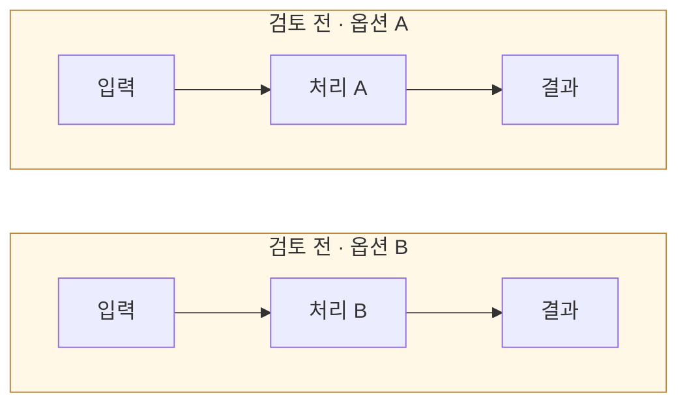

# [주제 제목]

[← 전체 선택 현황](total_trade_off.md)

작성 안내: 문답을 시작할 때 `번호-주제.md`로 복사하고 대괄호 자리표시자를 실제 내용으로 바꾼다.
아래 흐름·비교표는 양식 예시이며 R02의 설계나 채택 결정을 의미하지 않는다.

## 판단할 문제

[현재 상황, 결정이 필요한 이유, 선택 기준을 2~3문장으로 작성한다.]

> **검토 전 — 채택안 없음**
>
> [문답 후 선택한 옵션·이유·감수하는 비용을 기록한다. 합의 전에는 채택으로 표시하지 않는다.]

## 흐름 비교

노드는 짧게 쓰고 세부 조건은 본문·표에 기록한다. 아래 예시를 실제 대안별 흐름으로 바꾼다.

## 장단점 비교

같은 기준으로 옵션을 나란히 비교한다. 실제 후보 수에 맞춰 열을 조정한다.

| 기준 | 옵션 A | 옵션 B |
|---|---|---|
| [판단 기준 1] | [장점·비용] | [장점·비용] |
| [판단 기준 2] | [장점·한계] | [장점·한계] |

## 옵션별 판단

> **검토 전 — 옵션 A:** [문답 후 채택·미채택·보류 상태와 이유를 기록한다.]

> **검토 전 — 옵션 B:** [문답 후 채택·미채택·보류 상태와 이유를 기록한다.]

## 남은 사항

[해당 주제에 실제 미정 사항이 있을 때만 남긴다. 없으면 이 절을 삭제한다. 구현·검증 항목을 추가 트레이드오프로 확대하지 않는다.]
