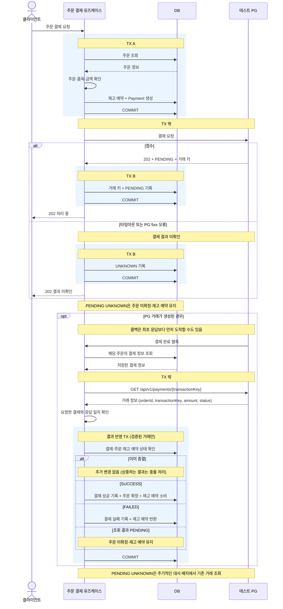

# 비동기 PG 결제와 콜백 처리

```mermaid
sequenceDiagram
    actor Client as 클라이언트
    participant App as 주문 결제 유즈케이스
    participant DB as DB
    participant PG as 테스트 PG

    Client->>App: 주문 결제 요청
    rect rgb(235, 245, 255)
        Note over App,DB: TX A
        App->>DB: 주문 조회
        DB-->>App: 주문 정보
        App->>App: 주문·품목·금액 확인
        App->>DB: 재고 예약 + Payment 생성
        App->>DB: COMMIT
    end
    Note over App,PG: TX 밖
    App->>PG: 결제 요청
    alt 접수
        PG-->>App: 202 + PENDING + 거래 키
        rect rgb(235, 245, 255)
            Note over App,DB: TX B
            App->>DB: 거래 키 + PENDING 기록
            App->>DB: COMMIT
        end
        App-->>Client: 202 처리 중
    else 타임아웃 또는 PG 5xx 오류
        Note over App,PG: 결제 결과 미확인
        rect rgb(235, 245, 255)
            Note over App,DB: TX B
            App->>DB: UNKNOWN 기록
            App->>DB: COMMIT
        end
        App-->>Client: 202 결과 미확인
    end
    Note over App,DB: PENDING·UNKNOWN은 주문 미확정·재고 예약 유지

    opt PG 거래가 생성된 경우
        Note over App,PG: 콜백은 최초 응답보다 먼저 도착할 수도 있음
        PG->>App: 결제 완료 웹훅
        App->>DB: 해당 주문의 결제 정보 조회
        DB-->>App: 저장된 결제 정보
        Note over App,PG: TX 밖
        App->>PG: GET /api/v1/payments/{transactionKey}
        PG-->>App: 거래 정보 (orderId, transactionKey, amount, status)
        App->>App: 요청한 결제와 응답 일치 확인
        rect rgb(235, 245, 255)
            Note over App,DB: 결과 반영 TX (검증된 거래만)
            App->>DB: 결제·주문·재고 예약 상태 확인
            alt 이미 종결
                Note over App,DB: 추가 변경 없음 (상충하는 결과는 충돌 처리)
            else SUCCESS
                App->>DB: 결제 성공 기록 + 주문 확정 + 재고 예약 소비
            else FAILED
                App->>DB: 결제 실패 기록 + 재고 예약 반환
            else 조회 결과 PENDING
                Note over App,DB: 주문 미확정·재고 예약 유지
            end
            App->>DB: COMMIT
        end
    end
    Note over App,PG: PENDING·UNKNOWN은 주기적인 대사 배치에서 기존 거래 조회
```
