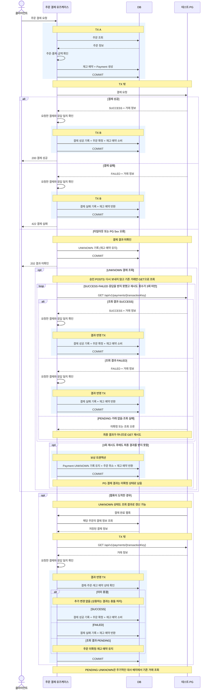

# 동기 PG 결제

```mermaid
sequenceDiagram
    actor Client as 클라이언트
    participant App as 주문 결제 유즈케이스
    participant DB as DB
    participant PG as 테스트 PG

    Client->>App: 주문 결제 요청
    rect rgb(235, 245, 255)
        Note over App,DB: TX A
        App->>DB: 주문 조회
        DB-->>App: 주문 정보
        App->>App: 주문·품목·금액 확인
        App->>DB: 재고 예약 + Payment 생성
        App->>DB: COMMIT
    end
    Note over App,PG: TX 밖
    App->>PG: 결제 요청
    alt 결제 성공
        PG-->>App: SUCCESS + 거래 정보
        App->>App: 요청한 결제와 응답 일치 확인
        rect rgb(235, 245, 255)
            Note over App,DB: TX B
            App->>DB: 결제 성공 기록 + 주문 확정 + 재고 예약 소비
            App->>DB: COMMIT
        end
        App-->>Client: 200 결제 성공
    else 결제 실패
        PG-->>App: FAILED + 거래 정보
        App->>App: 요청한 결제와 응답 일치 확인
        rect rgb(235, 245, 255)
            Note over App,DB: TX B
            App->>DB: 결제 실패 기록 + 재고 예약 반환
            App->>DB: COMMIT
        end
        App-->>Client: 422 결제 실패
    else 타임아웃 또는 PG 5xx 오류
        Note over App,PG: 결제 결과 미확인
        App->>DB: UNKNOWN 기록 (재고 예약 유지)
        App->>DB: COMMIT
        App-->>Client: 202 결과 미확인
        opt UNKNOWN 결제 조회
            Note over App,PG: 승인 POST는 다시 보내지 않고 기존 거래만 GET으로 조회
            loop SUCCESS·FAILED 응답을 받지 못했고 재시도 횟수가 3회 미만
                App->>PG: GET /api/v1/payments/{transactionKey}
                alt 조회 결과 SUCCESS
                    PG-->>App: SUCCESS + 거래 정보
                    App->>App: 요청한 결제와 응답 일치 확인
                    rect rgb(235, 245, 255)
                        Note over App,DB: 결과 반영 TX
                        App->>DB: 결제 성공 기록 + 주문 확정 + 재고 예약 소비
                        App->>DB: COMMIT
                    end
                else 조회 결과 FAILED
                    PG-->>App: FAILED + 거래 정보
                    App->>App: 요청한 결제와 응답 일치 확인
                    rect rgb(235, 245, 255)
                        Note over App,DB: 결과 반영 TX
                        App->>DB: 결제 실패 기록 + 재고 예약 반환
                        App->>DB: COMMIT
                    end
                else PENDING·거래 없음·조회 실패
                    PG-->>App: 미확정 또는 조회 오류
                    Note over App,PG: 최종 결과가 아니므로 GET 재시도
                end
            end
            opt 3회 재시도 후에도 최종 결과를 받지 못함
                rect rgb(235, 245, 255)
                    Note over App,DB: 보상 트랜잭션
                    App->>DB: Payment UNKNOWN 기록 유지 + 주문 취소 + 재고 예약 반환
                    App->>DB: COMMIT
                end
                Note over App,PG: PG 결제 결과는 미확정 상태로 남음
            end
        end
    end

    opt 웹훅이 도착한 경우
        Note over App,PG: UNKNOWN 상태도 조회 결과로 갱신 가능
        PG->>App: 결제 완료 웹훅
        App->>DB: 해당 주문의 결제 정보 조회
        DB-->>App: 저장된 결제 정보
        Note over App,PG: TX 밖
        App->>PG: GET /api/v1/payments/{transactionKey}
        PG-->>App: 거래 정보
        App->>App: 요청한 결제와 응답 일치 확인
        rect rgb(235, 245, 255)
            Note over App,DB: 결과 반영 TX
            App->>DB: 결제·주문·재고 예약 상태 확인
            alt 이미 종결
                Note over App,DB: 추가 변경 없음 (상충하는 결과는 충돌 처리)
            else SUCCESS
                App->>DB: 결제 성공 기록 + 주문 확정 + 재고 예약 소비
            else FAILED
                App->>DB: 결제 실패 기록 + 재고 예약 반환
            else 조회 결과 PENDING
                Note over App,DB: 주문 미확정·재고 예약 유지
            end
            App->>DB: COMMIT
        end
    end
    Note over App,PG: PENDING·UNKNOWN은 주기적인 대사 배치에서 기존 거래 조회
```
