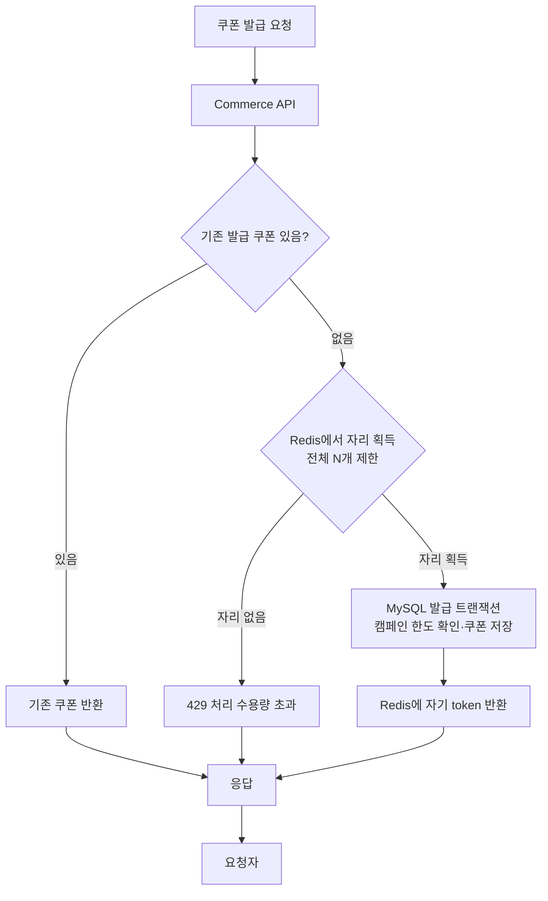

# 시스템 아키텍처

## 실행 환경

- Spring Boot Commerce API 인스턴스 3대
- 세 인스턴스가 공유하는 Redis 1대
- 쿠폰 캠페인과 발급 정보를 저장하는 MySQL
- 쿠폰 발급 동시 처리 수용량 `N`은 별도로 정한다.

## 쿠폰 발급 흐름

```mermaid
flowchart TB
    Request[쿠폰 발급 요청] --> API[Commerce API]
    API --> Existing{기존 발급 쿠폰 있음?}
    Existing -->|있음| ExistingResult[기존 쿠폰 반환]
    ExistingResult --> Response[응답]
    Existing -->|없음| Acquire{Redis에서 자리 획득<br/>전체 N개 제한}
    Acquire -->|자리 없음| Reject[429 처리 수용량 초과]
    Reject --> Response
    Acquire -->|자리 획득| Issue[MySQL 발급 트랜잭션<br/>캠페인 한도 확인·쿠폰 저장]
    Issue --> Release[Redis에 자기 token 반환]
    Release --> Response
    Response --> Client[요청자]
```

